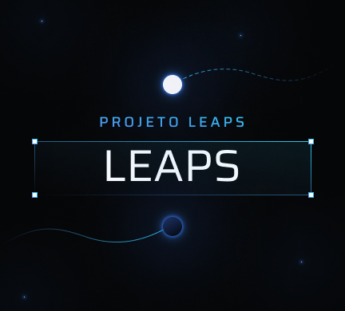

<h1 align="center">
    Projeto LEAPS
</h1>
<h1 align="center">
    
    <br>
</h1>

# LEAPS

Foi projetado e implementado um sistema para o gerenciamento de testes psicológicos, fornecidos pelos professores e alunos de psicologia. Esse sistema foi feito com o intuito de ser capaz de atender necessidades gerenciais da biblioteca de testes da psicologia da PUC e dos alunos e professores que desejam fazer reservas ou consultas sobre os testes disponíveis para empréstimo.

## Alunos integrantes da equipe

- [@Breno1210](https://github.com/Breno1210)
- [@Cadu1122](https://github.com/Cadu1122)
- [@GabrielRbrMendonca](https://github.com/GabrielRbrMendonca)
- [@LucasLS02](https://github.com/LucasLS02)
- [@Matheusbfreire](https://github.com/Matheusbfreire)
- [@saullo](https://github.com/saullo)

## Professores responsáveis

- [Lucila Ishitani]
- [Soraia Lúcia]

## Atenção
Esse repositório coloquei apenas o FrontEnd do Projeto, mas essa aplicação do site LEAPS é constituído por um sistema distribuído em 2 serviços, uma API REST desenvolvida na linguagem Python utilizando o framework Flask, e um frontend desenvolvido em HTML, CSS e JS utilizando de frameworks como REACT e SASS.

Além disso, vale ressaltar que a API do site está armazenada em containers de docker e que estão sendo gerenciados por um docker-compose.

# Sistema de Gerenciamento de Testes psicológicos

Esse projeto consiste da construção de um software responsável por realizar o gerenciamento de testes psicológicos do laboratório de psicologia da PUC Minas.

## Instruções de utilização do FrontEnd

1. Instalar o Node

   Voce deve instalar o [Node](https://nodejs.org/en/download/) para conseguir executar o site, de preferencia para baixar a versão LTS que se encontrar disponível, visto que essa versão terá suporte de longo prazo garantido.

2. Instalar o Yarn

   Voce deve instalar o [Yarn](https://classic.yarnpkg.com/en/) para conseguir gerenciar os pacotes do sistema que serão necessário para a execução da aplicação. (Talvez será necessário a instalação do [npm](https://www.npmjs.com/package/npm) que é um gerenciador de pacotes e versões do node para conseguir instalar o [Yarn](https://classic.yarnpkg.com/en/).)

3. Instalar os pacotes

   Assim que a instalação do node terminar, iremos iniciar a instalação dos pacotes necessários para rodar a aplicação. Abra o seu terminal na pasta `Codigo\frontend` e execute o seguinte comando para iniciar o download dos pacotes:

   ```powershell
   yarn install
   ```

4. Rodando a aplicação

   Se todas as etapas foram concluídas com sucesso, você poderá executar o seguinte comando para iniciar a aplicação:

   ```powershell
   yarn start
   ```

   Desse modo, voce poderá se dirigir ao seu navegador de preferencia e digitar a url `http://localhost:3000` que a aplicação se encontrará nesse endereço.

## ✒️ Authors

- [@Breno1210](https://github.com/Breno1210)
- [@Cadu1122](https://github.com/Cadu1122)
- [@GabrielRbrMendonca](https://github.com/GabrielRbrMendonca)
- [@LucasLS02](https://github.com/LucasLS02)
- [@Matheusbfreire](https://github.com/Matheusbfreire)
- [@saullo](https://github.com/saullo)
